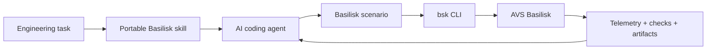

# Basilisk Tools

[](https://github.com/Cp557/basilisk-tools/actions/workflows/ci.yml)
[](LICENSE)

Agent-ready tooling for [AVS Basilisk](https://github.com/AVSLab/basilisk), the
spacecraft simulation framework developed by CU Boulder’s AVS Laboratory.
Basilisk Tools gives AI coding agents concise domain guidance plus deterministic
commands for inspecting, running, and verifying simulation scenarios.


## Why this exists

An agent can produce valid Python while still getting an engineering simulation
wrong: kilometers assigned where meters are expected, an incorrect reference
frame, a missing message connection, or a plausible plot with no numerical
verification. This project splits those responsibilities:



The skill teaches the workflow. The CLI supplies auditable facts. Basilisk
remains the simulation source of truth.

## Quick start

Python 3.11 and [`uv`](https://docs.astral.sh/uv/) are the supported v1 setup:

```bash
git clone https://github.com/Cp557/basilisk-tools.git
cd basilisk-tools
uv sync --locked --all-groups
export BSK_SUPPORT_DATA_CACHE=.bsk/support-data
uv run bsk doctor
uv run bsk inspect examples/orbit_propagation/scenario.py
uv run bsk verify examples/orbit_propagation/scenario.py
```

The first J2 operation downloads Basilisk’s versioned degree-2 gravity support
file. Generated runs and verification artifacts are stored under `.bsk/`.

## CLI

| Command | Purpose |
| --- | --- |
| `bsk doctor` | Report Python, Basilisk, tool, and dependency versions |
| `bsk run <scenario.py>` | Execute trusted Python in a child process and preserve logs and artifacts |
| `bsk inspect <scenario.py>` | Report declared processes, tasks, modules, messages, and telemetry |
| `bsk verify <scenario-or-run>` | Execute or load deterministic numerical checks |

Every command has readable terminal output; use `--json` for agent-readable
output. A successful `run` proves process completion, not physical correctness.

## Reference result: point mass vs J2

The flagship scenario propagates the same 7,000 km semi-major-axis LEO for five
hours with point-mass and degree-2 J2 Earth gravity.

<p align="center">
  
  
</p>

The verified J2 nodal rate is `-8.348e-7 rad/s`, within `0.117%` of first-order
secular theory. The point-mass case holds relative Keplerian-energy drift below
`8e-11`; the J2 case holds inertial angular-momentum-z drift below `4e-11`.
See [the result interpretation](docs/orbit-results.md) for assumptions and claim
boundaries.

### Optional 3D playback

Generate verified point-mass and J2 recordings for AVS Lab's Unity-based Vizard
application:

```bash
uv run bsk run examples/orbit_propagation/vizard.py --json
```

The `.bin` playback files are registered beside the same telemetry and checks.
See the [Vizard guide](docs/vizard.md) for installation and playback.

## Agent skill

One canonical [Basilisk skill](skills/basilisk/SKILL.md) works with Codex,
Claude Code, and other Agent Skills-compatible tools. It routes agents to short
references for architecture, scenario development, orbit propagation,
telemetry, verification, and debugging. See the [installation guide](docs/skill-installation.md).

## Evaluations

Four reproducible cases test two-body creation, J2 configuration, unit-error
repair, and telemetry repair. External verifiers calculate their own physics
checks from raw state histories instead of trusting candidate-authored metrics.
See [the evaluation protocol](evals/README.md).

The harness is calibrated, but no comparative Codex/Claude results are
published yet. [Evaluation results](evals/results/README.md) clearly distinguish
that pending experiment from completed engineering checks.

## Project status

The implementation, reference scenario, skill, evaluation harness,
documentation, tests, CI, and generated visuals form a v1 release candidate.
Before a public portfolio release, run and publish the controlled agent matrix,
push the release candidate, and confirm the first GitHub Actions run is green.

## Documentation

- [Architecture](docs/architecture.md)
- [Orbit-propagation results](docs/orbit-results.md)
- [End-to-end demonstration](docs/demo.md)
- [Example structured output](docs/example-output.md)
- [Vizard playback](docs/vizard.md)
- [V1 release checklist](docs/release-checklist.md)
- [Skill installation](docs/skill-installation.md)
- [Evaluation method](evals/README.md)
- [Technical reference](REFERENCE.md)
- [Implementation plan](PLAN.md)
- [MIT license](LICENSE)

## Scope and limitations

Basilisk Tools executes trusted local scenarios. Deep inspection and semantic
verification require the optional scenario contract; arbitrary Python can only
receive process-level evidence. V1 targets Python 3.11 and Basilisk 2.11.1 and
does not provide a bundled GUI, cloud runner, solver abstraction, Monte Carlo
system, or automatic inference of units, frames, telemetry, or physical
correctness. Optional Vizard playback uses a separately installed application.
