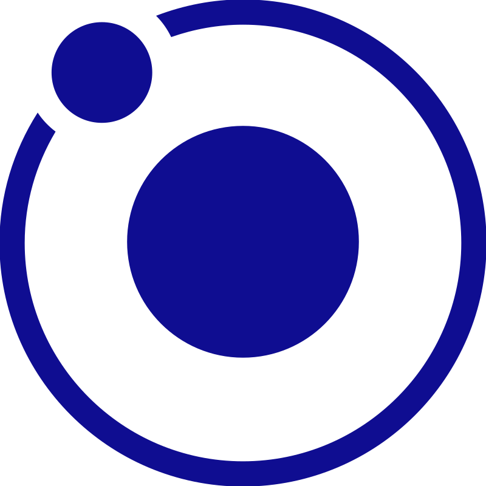
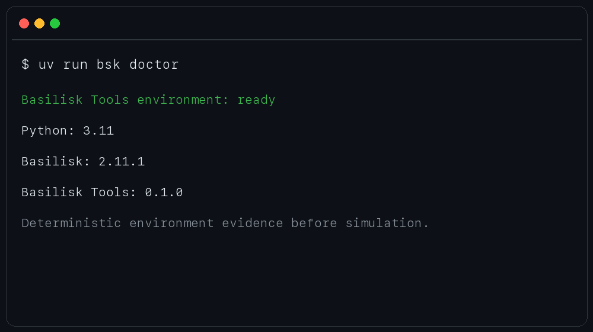
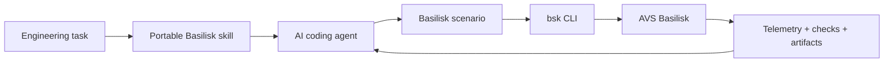
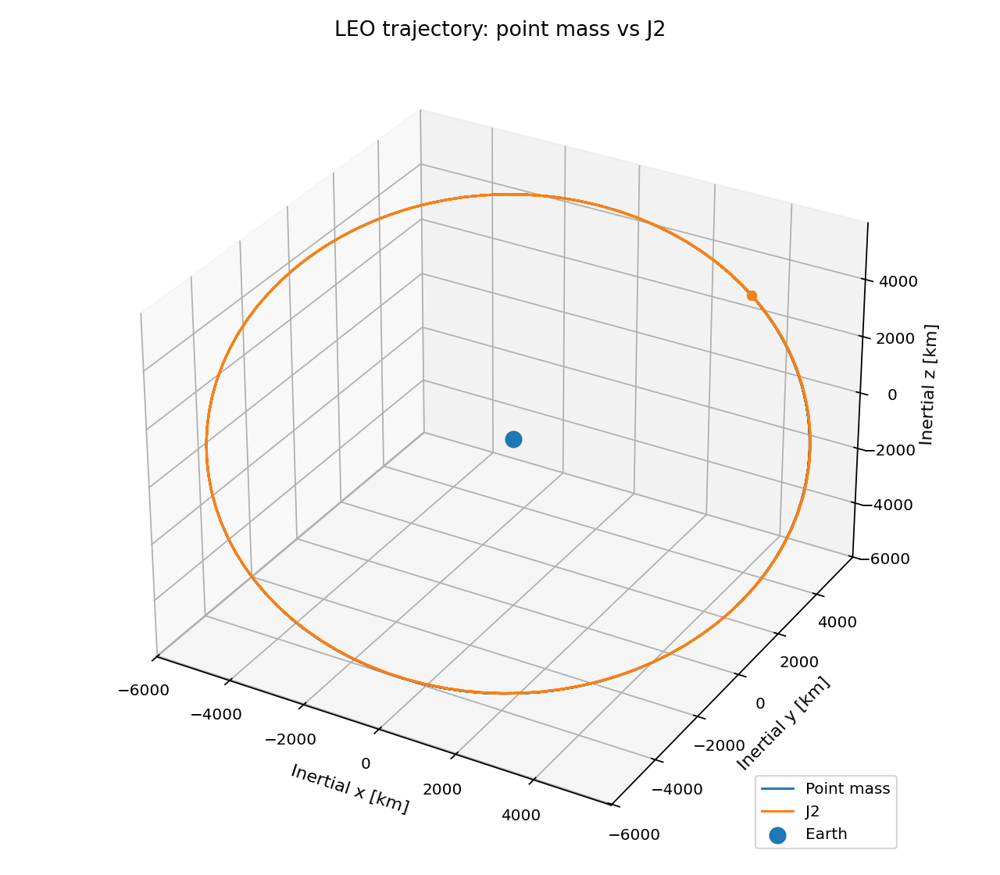
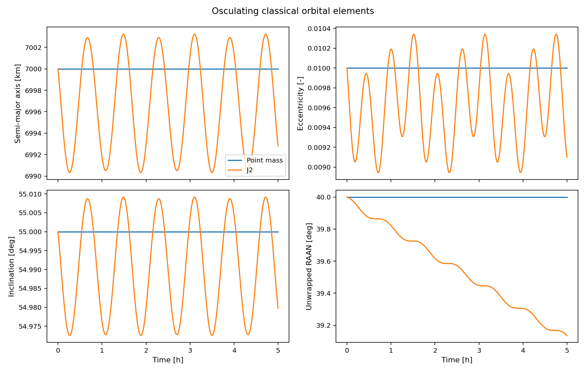

# Basilisk Tools

<p align="center">
  
</p>

[](https://github.com/Cp557/basilisk-tools/actions/workflows/ci.yml)
[](LICENSE)

Agent-ready tooling for [AVS Basilisk](https://github.com/AVSLab/basilisk), CU
Boulder's spacecraft simulation framework. A portable skill provides domain
guidance while the `bsk` CLI inspects, runs, and verifies scenarios.



An agent can produce valid Python while still getting an engineering simulation
wrong: kilometers assigned where meters are expected, an incorrect reference
frame, a missing message connection, or an unverified plot.



The skill guides the agent; the CLI supplies evidence; Basilisk supplies the
simulation.

## Quick start

Requires Python 3.11+ and [`uv`](https://docs.astral.sh/uv/):

```bash
git clone https://github.com/Cp557/basilisk-tools.git
cd basilisk-tools
uv sync --locked --all-groups
export BSK_SUPPORT_DATA_CACHE=.bsk/support-data
uv run bsk doctor
uv run bsk inspect examples/orbit_propagation/scenario.py
uv run bsk verify examples/orbit_propagation/scenario.py
```

The first J2 command downloads a versioned gravity file. Outputs go to `.bsk/`.

## CLI

| Command | Purpose |
| --- | --- |
| `bsk doctor` | Check Python, Basilisk, and dependencies |
| `bsk run <scenario.py>` | Execute trusted Python in a child process and preserve logs and artifacts |
| `bsk inspect <scenario.py>` | Report declared structure and telemetry |
| `bsk verify <scenario-or-run>` | Execute or load deterministic numerical checks |

Use `--json` for agent-readable output. A successful run proves execution, not
physical correctness.

## Reference result: point mass vs J2

The flagship scenario propagates the same 7,000 km semi-major-axis LEO for five
hours with point-mass and degree-2 J2 Earth gravity.

<p align="center">
  
  
</p>

The verified J2 nodal rate is `-8.348e-7 rad/s`, within `0.117%` of first-order
secular theory. The point-mass case holds relative Keplerian-energy drift below
`8e-11`; the J2 case holds inertial angular-momentum-z drift below `4e-11`.
See [the result interpretation](docs/orbit-results.md) for assumptions and claim
boundaries.

### Optional 3D playback

Generate verified point-mass and J2 recordings for AVS Lab's Unity-based Vizard
application:

```bash
uv run bsk run examples/orbit_propagation/vizard.py --json
```

See the [Vizard guide](docs/vizard.md) to open the registered `.bin` files.

## Agent skill

The canonical [Basilisk skill](skills/basilisk/SKILL.md) works with Codex,
Claude Code, and other Agent Skills-compatible tools. See the
[installation guide](docs/skill-installation.md).

## Project status

The CLI, skill, demo, tests, and documentation form the `v0.1.0` release
candidate.

## Documentation

[Architecture](docs/architecture.md) · [Results](docs/orbit-results.md) ·
[Demo](docs/demo.md) · [JSON examples](docs/example-output.md) ·
[Vizard](docs/vizard.md) · [Skill installation](docs/skill-installation.md) ·
[Technical reference](REFERENCE.md) · [Release checklist](docs/release-checklist.md) ·
[MIT license](LICENSE)

## Scope and limitations

Scenarios are trusted local code. Deep inspection and semantic verification
require the optional scenario contract. V1 targets Basilisk 2.11.1 and does not
infer units, frames, telemetry, or physical correctness. Vizard is installed
separately.
