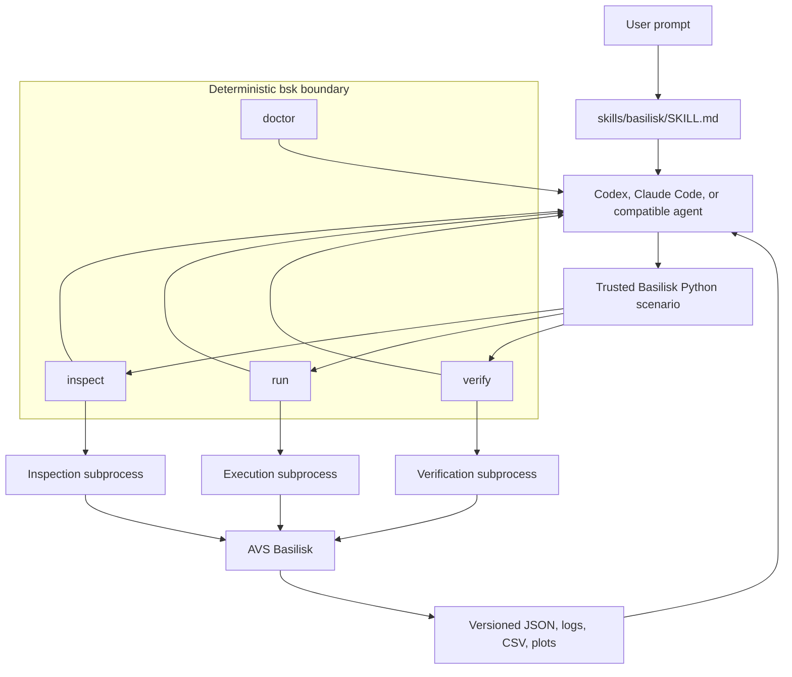
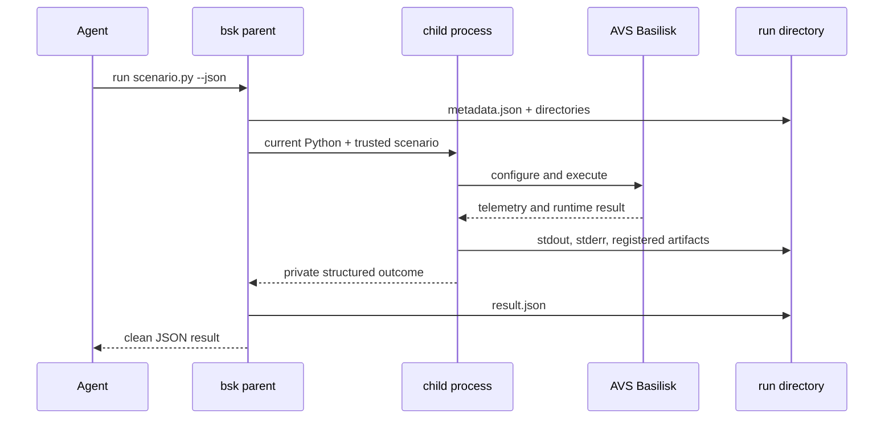

# Architecture

Basilisk Tools is deliberately small: a portable instruction layer helps an AI
agent use Basilisk correctly, while a deterministic execution layer gathers the
facts needed to check its work.

## Responsibilities

| Component | Responsible for | Not responsible for |
| --- | --- | --- |
| Basilisk skill | Domain workflow, warnings, source routing, evidence discipline | Numerical truth or executing code |
| `bsk` CLI | Isolation, runtime facts, structured output, artifact preservation | Replacing the Basilisk Python API |
| Scenario contract | Exposing configured cases, telemetry declarations, and checks | General plugin lifecycle or arbitrary-code inference |
| AVS Basilisk | Simulation execution and runtime behavior | Deciding whether the user's engineering claim is justified |

## Scenario support levels

A standard trusted Python scenario runs through `bsk run`. The tool records its
hash, versions, timing, exit status, logs, and registered artifacts, but does not
claim to understand its physics.

An instrumented scenario additionally defines `basilisk_tools_scenario()`. The
factory returns configured, unexecuted cases for inspection and a deterministic
verification callback. This enables `bsk inspect` and `bsk verify` without
pretending arbitrary Python can be interpreted safely or completely.

## Process and data flow

Child stdout is never used as structured transport, so arbitrary scenario
logging cannot corrupt CLI JSON. Timeouts and interruptions stop the child
process group. The complete environment is not captured because it may contain
secrets.

## Trust and claim boundaries

- Scenarios are trusted local code and can do anything the current user can do.
- Units and frames are declared, never inferred from variable names.
- `inspect` reports available Basilisk runtime structure and declared metadata.
- `run` success is process evidence only.
- Numerical claims require recorded telemetry and checks with stated tolerances.
- Point-mass Keplerian energy is not treated as a J2 conservation invariant.
